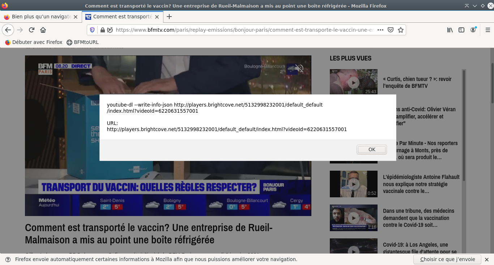

# BFMTV to URL converter (for youtube-dl)

The youtube-dl parser for BFMTV* is broken as of 01/2021, this is an implementation of *moimadmax* method as explained in his [comment](https://github.com/ytdl-org/youtube-dl/issues/18595#issuecomment-449752824) that works for single item and batch download. 

\*Works for their whole network: [BFMTV](https://bfmtv.com), [BFM Business](https://bfmtv.com/economie), [RMC](https://rmc.bfmtv.com/), [RMC Sport](https://rmcsport.bfmtv.com/), [RMC Découverte](https://rmcdecouverte.bfmtv.com/), [RMC Story](https://rmcstory.bfmtv.com/), [BFM Régions](https://www.bfmtv.com/regions/), [BFM Bourse](https://www.tradingsat.com/)


| Bookmarklet       | Shell OneLiner |
|-------------------|----------------|
|  | W.I.P          |

## Bookmarklet

This bookmarklet displays the youtube-dl command to type to download this program and it's URL (useful to play it in VLC mpv... or use another extractor). Double click on the line you want and press Ctrl+C (Cmd+C on mac) to copy in your clipboard.

Just select the code below and drop it on your bookmark bar (disabled by default on firefox --- > Customize > Toolbars (in the bottom) > tick Personal bar)

For convenience, rename it to BFMtoURL by right clicking the new bookmark.

```javascript:void((function(){let iddecomptea=document.querySelectorAll('[data-account]')[0];if(iddecomptea===undefined){var iddecompte=document.querySelectorAll('[accountid]')[0].getAttribute("accountid")}else{var iddecompte=iddecomptea.getAttribute("data-account")}let iddevideo=document.querySelectorAll('[data-video-id]')[0].getAttribute("data-video-id");let urldevideo="http://players.brightcove.net/"+iddecompte+"/default_default/index.html?videoId="+iddevideo;alert('youtube-dl --write-info-json '+urldevideo+'\r\n\r\nURL:\r'+urldevideo)})());```

## JS method

You'll need **Absolute enable right click and copy** for Firefox [link](https://addons.mozilla.org/en-US/firefox/addon/absolute-enable-right-click/) or a similar Chrome/Chromium extension.

Go to the page you want the video from and press **F12**, type or paste the code here in the console tab, it'll return the *id*, *link* or complete *youtube-dl command* to get your video.

### Get data-video-id

``` document.querySelectorAll('[data-video-id]')[0].getAttribute("data-video-id"); ```

### Get brightcove url

``` console.log("http://players.brightcove.net/"+document.querySelectorAll('[accountid]')[0].getAttribute("accountid")+"/default_default/index.html?videoId="+document.querySelectorAll('[data-video-id]')[0].getAttribute("data-video-id")); ```

### Get youtube-dl command

``` console.log("youtube-dl http://players.brightcove.net/"+document.querySelectorAll('[accountid]')[0].getAttribute("accountid")+"/default_default/index.html?videoId="+document.querySelectorAll('[data-video-id]')[0].getAttribute("data-video-id")); ```

### Get youtube-dl command with metadata

``` console.log("youtube-dl --write-info-json http://players.brightcove.net/"+document.querySelectorAll('[accountid]')[0].getAttribute("accountid")+"/default_default/index.html?videoId="+document.querySelectorAll('[data-video-id]')[0].getAttribute("data-video-id")); ```

## Shell method (for Unix* terminals)

``` COMING SOON ```

