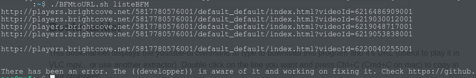

# BFMTV player to brightcove URL converter (for youtube-dl, VLC, mpv)

The youtube-dl parser for BFMTV* is broken as of 01/2021, this is an implementation of *moimadmax* method as explained in his [comment](https://github.com/ytdl-org/youtube-dl/issues/18595#issuecomment-449752824) that works for single item and batch download. 

You can now eaisily watch your favorite BFMTV* replay programs in VLC or download them to view them while offline (during a plane travel for instance)

\*Works for their whole network: [BFMTV](https://bfmtv.com), [BFM Business](https://bfmtv.com/economie), [RMC](https://rmc.bfmtv.com/), [RMC Sport](https://rmcsport.bfmtv.com/), [RMC Découverte](https://rmcdecouverte.bfmtv.com/), [RMC Story](https://rmcstory.bfmtv.com/), [BFM Régions](https://www.bfmtv.com/regions/), [BFM Bourse](https://www.tradingsat.com/)


| Bookmarklet       | Bash Shell Script |
|-------------------|----------------|
|  |          |
| For single use | For batch download |

## Features

- several solutions for each use case
- error reporting (so that I know when an update is needed)
- argument input with STDIN, as a batch text file (one line = one bfmtv link) or as argument
- bookmarklet and simple js grabber for easy tinkering in your web browser

## TODO:

- add BFM icons in the README
- error reporting on the js version (not an emergency as it is obvious to the user when he doesn't get the link he asked for)
- tell someone who can repair the native youtubedl parser

## Bookmarklet

This bookmarklet displays the youtube-dl command to type to download this program and it's URL (useful to play it in VLC mpv... or use another extractor). Double click on the line you want and press Ctrl+C (Cmd+C on mac) to copy in your clipboard.

Just select the code below (triple click works) and drop it on your bookmark bar (disabled by default on firefox --- > Customize > Toolbars (in the bottom) > tick Personal bar)

For convenience, rename it to BFMtoURL by right clicking the new bookmark.

```javascript:void((function(){let iddecomptea=document.querySelectorAll('[data-account]')[0];if(iddecomptea===undefined){var iddecompte=document.querySelectorAll('[accountid]')[0].getAttribute("accountid")}else{var iddecompte=iddecomptea.getAttribute("data-account")}let iddevideo=document.querySelectorAll('[data-video-id]')[0].getAttribute("data-video-id");let urldevideo="http://players.brightcove.net/"+iddecompte+"/default_default/index.html?videoId="+iddevideo;alert('youtube-dl --write-info-json '+urldevideo+'\r\n\r\nURL:\r'+urldevideo)})());```

## Shell method (for Unix* terminals)

Download BFMtoURL.sh, go to the directory of the download with a terminal and do ```sudo chmod +x``` to make it executable, you can now use it as such.	

The current shell implementation outputs an empty line for unavailable videos (and if an error or update of the site should happen on their end), this behaviour is easily editable (three of the ``` echo "" ``` to comment with ``` # ``` (l. 15,30,46)).

  ``` ./BFMtoURL.sh https://www.bfmtv.com/paris/replay-emissions/bonjour-paris/comment-est-transporte-le-vaccin-une-entreprise-de-rueil-malmaison-a-mis-au-point-une-boite-refrigeree_VN-202101060214.html ```	
		
### If you download a lot of BFMTV videos	
you can easily create an alias for the script to get the url or give it to youtubedl, if the .sh is in your home directory (~), type:

```

alias bfmtv="bash ~/BFMtoURL.sh"

```

to create a temporary alias for the script, you may now type ```bfmtv``` in the shell instead, to make it permanent, see: https://www.tecmint.com/create-alias-in-linux/#Creating%20Permanent%20Aliases
		
	

### as an argument

```
./BFMtoURL.sh https://www.bfmtv.com/paris/replay-emissions/bonjour-paris/comment-est-transporte-le-vaccin-une-entreprise-de-rueil-malmaison-a-mis-au-point-une-boite-refrigeree_VN-202101060214.html
```

### with input text file

```
./BFMtoURL.sh filename or /path/to/file
```

### using STDIN from another command

``` 
somecommand* | ./BFMtoURL.sh

echo "https://www.bfmtv.com/paris/replay-emissions/bonjour-paris/comment-est-transporte-le-vaccin-une-entreprise-de-rueil-malmaison-a-mis-au-point-une-boite-refrigeree_VN-202101060214.html" | ./BFMtoURL.sh
```
*the command must output a single URL at a time

## JS method (F12 > js console)

You'll need **Absolute enable right click and copy** for Firefox [link](https://addons.mozilla.org/en-US/firefox/addon/absolute-enable-right-click/) or a similar Chrome/Chromium extension.

Go to the page you want the video from and press **F12**, type or paste the code here in the console tab, it'll return the *id*, *link* or complete *youtube-dl command* to get your video.

### Get data-video-id

``` document.querySelectorAll('[data-video-id]')[0].getAttribute("data-video-id"); ```

### Get brightcove url

``` console.log("http://players.brightcove.net/"+document.querySelectorAll('[accountid]')[0].getAttribute("accountid")+"/default_default/index.html?videoId="+document.querySelectorAll('[data-video-id]')[0].getAttribute("data-video-id")); ```

### Get youtube-dl command

``` console.log("youtube-dl http://players.brightcove.net/"+document.querySelectorAll('[accountid]')[0].getAttribute("accountid")+"/default_default/index.html?videoId="+document.querySelectorAll('[data-video-id]')[0].getAttribute("data-video-id")); ```

### Get youtube-dl command with metadata

``` console.log("youtube-dl --write-info-json http://players.brightcove.net/"+document.querySelectorAll('[accountid]')[0].getAttribute("accountid")+"/default_default/index.html?videoId="+document.querySelectorAll('[data-video-id]')[0].getAttribute("data-video-id")); ```

